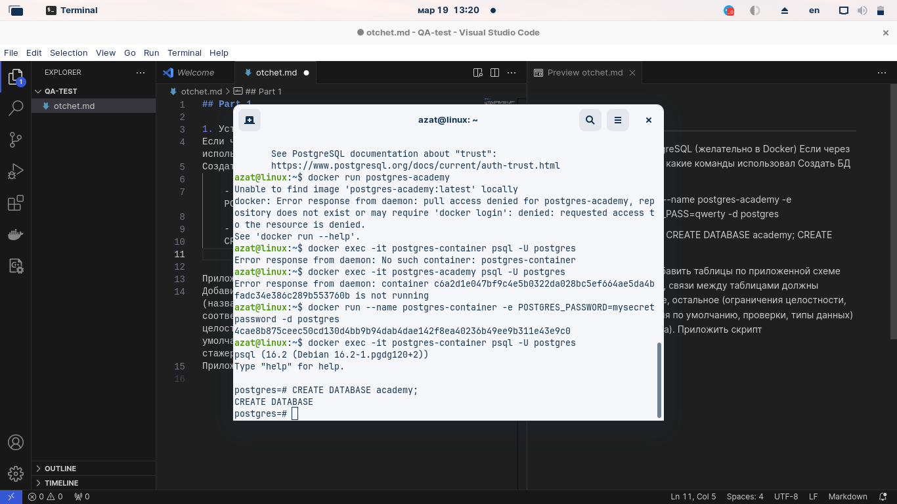
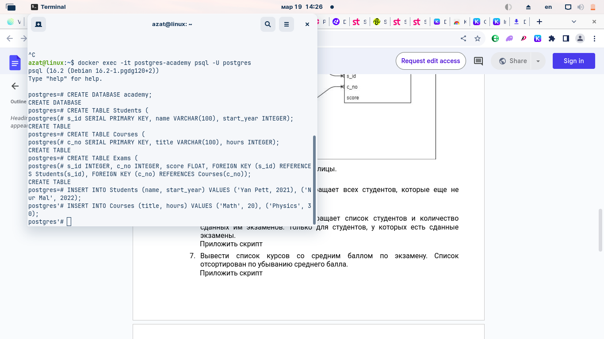
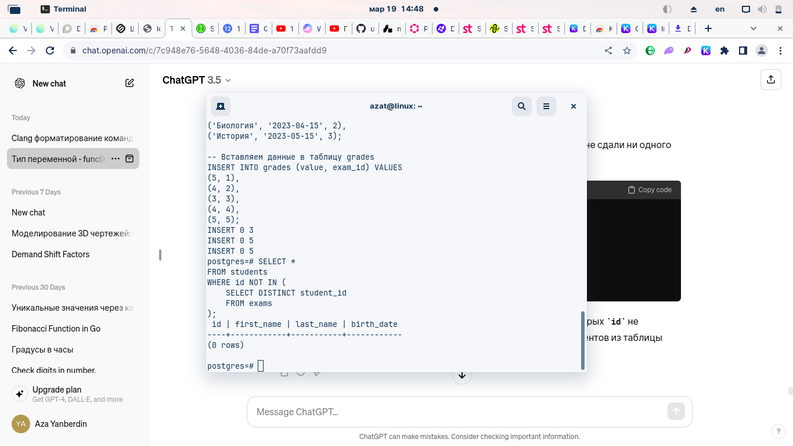

## Part 1

План тестирования интернет-магазина
1. Подготовительный этап.
Ознакомление с требованиями и документацией проекта.
Построение модели пользовательских сценариев.
Планирование тестовых активностей и ресурсов.
2. Тестирование функциональности каталога товаров.
Проверка отображения категорий и товаров.
Проверка работы поиска по каталогу.
Тестирование сортировки и фильтрации товаров.
Проверка корректности отображения информации о товаре.
3. Тестирование функционала корзины.
Проверка возможности добавления товаров в корзину.
Проверка корректности отображения содержимого корзины.
Тестирование функционала изменения количества товаров в корзине.
Проверка возможности удаления товаров из корзины.
4. Тестирование оформления заказа.
Проверка работы оформления заказа для зарегистрированных и незарегистрированных пользователей.
Тестирование ввода и валидации персональных данных при оформлении заказа.
Проверка работы выбора способа доставки.
Тестирование расчета и отображения стоимости заказа.
5. Тестирование онлайн-оплаты.
Проверка интеграции с сервисом онлайн-оплаты.
Тестирование процесса оплаты с использованием различных способов оплаты (банковские карты, электронные кошельки и т. д.).
Проверка корректности обработки различных статусов оплаты (успешная оплата, отмена платежа и т. д.).
6. Тестирование производительности и нагрузочное тестирование.
Проведение нагрузочного тестирования для оценки производительности системы при различных нагрузках.
Анализ результатов тестирования производительности и оптимизация системы при необходимости.
7. Финальное тестирование и исправление ошибок.
Повторное тестирование всех функциональных возможностей приложения перед релизом.
Выявление и исправление ошибок и недочетов.
Подготовка документации по результатам тестирования.
8. Пострелизное тестирование и поддержка.
Мониторинг работы системы в реальных условиях после выпуска.
Реагирование на обнаруженные пользовательские отзывы и ошибки.
Планирование и выполнение исправлений и улучшений в рамках поддержки.
Ресурсы
QA-инженер: 1 человек.
Доступ к окружению разработки для проведения тестирования.
Доступ к документации и требованиям проекта.
Доступ к системе отслеживания ошибок для отчетности и управления задачами.
Метрики качества
Количество обнаруженных и исправленных ошибок на единицу времени.
Степень покрытия тестами различных модулей и функциональных возможностей.
Время реакции на обнаруженные проблемы и время внесения исправлений.

## Part 2

1. Установить PostgreSQL (желательно в Docker)
Если через Docker - описать какие команды использовал
Создать БД academy.

    - docker run --name postgres-academy -e POSTGRES_PASS=qwerty -d postgres

    - postgres=# CREATE DATABASE academy;
    CREATE DATABASE

2. Добавить таблицы по приложенной схеме рис. 1 (названия полей, связи между таблицами должны соответствовать схеме, остальное (ограничения целостности, уникальность, значения по умолчанию, проверки, типы данных) на усмотрение стажера).
Приложить скрипт
    - 

3. Добавить несколько записей в таблицы. 
Приложить скрипт
    - 

4. Написать запрос, который возвращает всех студентов, которые еще не сдали ни одного экзамена.
Приложить скрипт
    - 

5. Написать запрос, который возвращает список студентов и количество сданных им экзаменов. Только для студентов, у которых есть сданные экзамены.
Приложить скрипт
    - SELECT s.id AS student_id, s.student_name, COUNT(e.exam_id) AS exams_passed
FROM students s
JOIN exams e ON s.id = e.student_id
GROUP BY s.id, s.student_name;

6. Вывести список курсов со средним баллом по экзамену. Список отсортирован по убыванию среднего балла.
Приложить скрипт
    - SELECT c.course_name, AVG(e.grade) AS average_grade
FROM courses c
JOIN exams e ON c.course_id = e.course_id
GROUP BY c.course_id, c.course_name
ORDER BY average_grade DESC;

7. *
    - 
CREATE TABLE students (
    student_id SERIAL PRIMARY KEY,
    student_name VARCHAR(50),
    birth_date DATE,
    gender VARCHAR(10)
);

INSERT INTO students (student_name, birth_date, gender)
SELECT 
    CONCAT('Student_', s),
    DATE '1990-01-01' + INTERVAL '1 day' * FLOOR(RANDOM() * 10000),
    CASE WHEN RANDOM() < 0.5 THEN 'Male' ELSE 'Female' END
FROM generate_series(1, 50) AS s;

CREATE TABLE exams (
    exam_id SERIAL PRIMARY KEY,
    student_id INT REFERENCES students(student_id),
    exam_date DATE,
    course_name VARCHAR(50),
    grade DECIMAL(5, 2)
);

INSERT INTO exams (student_id, exam_date, course_name, grade)
SELECT 
    FLOOR(RANDOM() * (SELECT MAX(student_id) FROM students)) + 1,
    DATE '2020-01-01' + INTERVAL '1 day' * FLOOR(RANDOM() * 365),
    CASE
        WHEN RANDOM() < 0.3 THEN 'Math'
        WHEN RANDOM() < 0.6 THEN 'Physics'
        ELSE 'Chemistry'
    END,
    RANDOM() * 100
FROM generate_series(1, 100) AS e;

